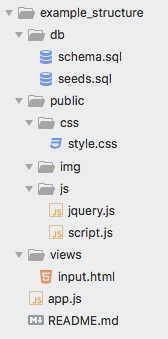

# Necromancer
Creates a Javascript CRUD Skeleton

## Table of Reference: 
 - What Necromancer Does
 - How To Use
 - More To Come

### What Necromancer Does
This node script builds out a complete Javascript CRUD app w/ an express server. This scaffold comes complete with a built out database, public folder(css,js,img), views(index.html) and a completely built out express server in app.js, which is placed in the root folder. 
Find a picture of the expanded file structure below. 

### How To Use
 - Download the repo
 - Once you are in the root of this project in your terminal, run __node necro.js nameOfYourNewCrudApp__

### MORE TO COME!!!
    - Populate CSS file w/ reset code
    - Make Global CLI
    - Build out Schema Files via CLI. 

### Technologies used: 
    - 

